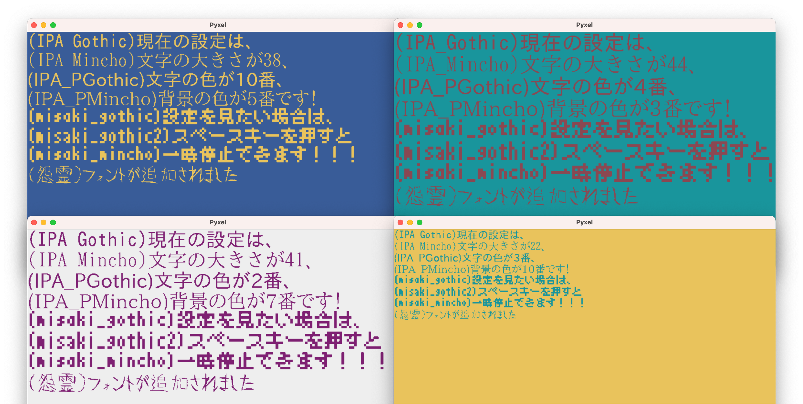

# PyxelUniversalFont



PyxelUniversalFontは、公開されている"pyxel"ライブラリにフォントを追加するための拡張ツールです。

## 目次

- [機能](#機能)
- [インストール方法](#インストール方法)
- [使用方法](#使用方法)
- [サポートしているフォント](#サポートしているフォント)
- [コマンド一覧](#コマンド一覧)
- [更新情報](#更新情報)
- [ライセンス](#ライセンス)

## 機能

- pyxelで使える追加のフォントを簡単にインストール
- カスタムフォントの追加サポート
- pyxelのゲームやアプリケーションでの文字表示を綺麗に、多様に

## インストール方法

```bash
pip install pyxel-universal-font
```

その後、pyxelのプロジェクト内で以下のようにインポートしてください。

```python
import PyxelUniversalFont
```

## 使用方法

PyxelUniversalFont（以下、puf）は、Pyxel内でさまざまなフォントを使用するためのツールキットです。このツールキットを使うことで、Pyxelのゲームやアプリケーションにカスタムフォントを簡単に追加することができます。

### フォントの設定

まず、`puf.Writer("フォントファイル名")`を使用して、使用したいフォントを指定します。例えば、`puf.Writer("misaki_gothic.ttf")`とすることで、misaki_gothic.ttfというフォントを指定しています。

- 利用可能なフォントの一覧は`puf.get_available_fonts()`を使用して取得できます。

- また、すべての利用可能なフォントを一度にアクティベートしたい場合は、`puf.get_writers()`を使用すると便利です。この関数は各フォントに対するwriterオブジェクトを含む辞書を返します。

### テキストの描画

指定したフォントを用いて、テキストを描画するには、writer.draw()メソッドを使用します。このメソッドは以下の引数を取ります：

- x, y: テキストの描画開始位置
- text: 描画するテキスト内容
- font_size: フォントのサイズ（デフォルトは16）
- color: テキストの色（1〜15がPyxelのデフォルトカラー、16はモザイク。デフォルトは0、すなわち黒）
- bg_color: テキストの背景色（デフォルトは-1、すなわち透明）

このメソッドを使用することで、簡単にPyxel上にテキストを描画することができます。

### サンプルコード

```python
import pyxel
import PyxelUniversalFont as puf

pyxel.init(500, 50)

# フォントを指定
writer = puf.Writer("misaki_gothic.ttf")

pyxel.cls(7)

# draw(x座標, y座標, テキスト, フォントサイズ, 文字の色(16:モザイク))
# 背景色はデフォルト値(-1:透明)
writer.draw(25, 4, "PyselUniversalFont", 50, 16)

pyxel.show()
```

## サポートしているフォント

以下は、デフォルトでサポートされているフォントです。

1. [IPAexフォント](https://moji.or.jp/ipafont/ipafontdownload/)
    - IPA ゴシック
    - IPA Pゴシック
    - IPA 明朝
    - IPA P明朝

2. [美咲フォント](https://littlelimit.net/misaki.htm)
    - 美咲ゴシック
    - 美咲ゴシック第2
    - 美咲明朝

次のコマンドで開かれるディレクトリに、任意のフォントを追加できます。
```bash
puf edit
```

## コマンド一覧

1. サンプルアプリケーションの起動:
```bash
puf sample
```
2. フォント保存用ディレクトリを開く:
```bash
puf edit
```

## 更新情報
- 2023.09.25：安定版(v1.1.0)が公開されました。

## ライセンス

MITライセンスの下で公開されています。詳細は`LICENSE`ファイルを参照してください。